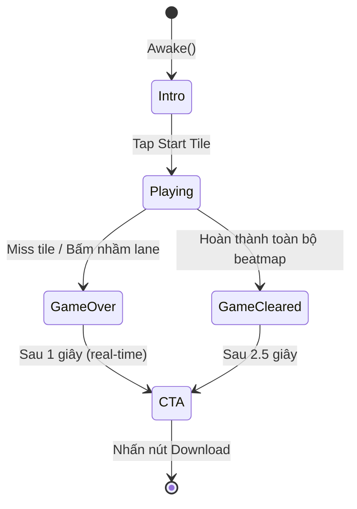

# 📋 Phân Tích Toàn Bộ Luồng Game — Rhythm Ad (Squid Game Theme)

> **Project:** `d:\UPLIVE\TestCase`  
> **Engine:** Unity (WebGL target) | **Ngày phân tích:** 2026-04-21

---

## 1. Tổng Quan Kiến Trúc

Game là một **Playable Ad dạng Rhythm Game** (nhạc: "Round And Round") được build cho WebGL.  
Kiến trúc chia thành 9 module độc lập, giao tiếp qua **Event-driven pattern** (static C# events).

```
Assets/Scripts/
├── Core/
│   ├── GameState.cs          — Enum: GameState, TileType, TileState
│   ├── GameManager.cs        — Singleton state machine + scoring
│   └── OrientationManager.cs — Responsive layout (portrait/landscape)
├── Config/
│   └── GameConfig.cs         — ScriptableObject chứa toàn bộ config + beatmap
├── Audio/
│   └── AudioManager.cs       — Nhạc nền
├── Spawner/
│   ├── TilePool.cs           — Object pooling cho 3 loại tile
│   └── TileSpawner.cs        — Spawn tile theo beatmap timestamp
├── Tiles/
│   ├── TileController.cs     — Logic di chuyển, hit detection, miss
│   ├── TileHoldEffect.cs     — Hiệu ứng fill vàng khi giữ Long Tile
│   └── StartPanelController.cs — Logic tap Start Tile để bắt đầu game
├── Input/
│   └── InputHandler.cs       — Multi-touch + mouse, lane detection
├── Scoring/
│   └── ScoreManager.cs       — Feedback visual + camera shake
├── UI/
│   ├── UIManager.cs          — Quản lý 3 panel (Intro/Ingame/CTA)
│   ├── LaneFlashEffect.cs    — Chớp đỏ khi bấm nhầm lane
│   └── GridVisualizer.cs     — Vẽ lưới lane bằng LineRenderer
└── CTA/
    └── CTAManager.cs         — Màn hình Call-To-Action + nút Download
```

---

## 2. State Machine — Luồng Chính



### Enum `GameState`
| State | Ý nghĩa |
|---|---|
| `Intro` | Màn hình chờ, Start Tile đang hiển thị |
| `Playing` | Gameplay đang diễn ra, nhạc phát |
| `GameOver` | Người chơi miss tile / bấm nhầm |
| `GameCleared` | Hoàn thành toàn bộ beatmap (Win) |
| `CTA` | Màn hình Call-To-Action, nút Download |

---

## 3. Chi Tiết Từng Hệ Thống

### 3.1 `GameManager` — Trung Tâm Điều Phối

**Singleton.** Là hub trung tâm; các module khác lắng nghe event thay vì gọi trực tiếp.

#### Events phát ra:
| Event | Tham số | Ý nghĩa |
|---|---|---|
| `OnGameStateChanged` | `(oldState, newState)` | Chuyển state — tất cả module lắng nghe |
| `OnScoreChanged` | `int score` | UIManager cập nhật score display |
| `OnComboChanged` | `int combo` | (hiện chưa dùng ở UI) |

#### Logic nội bộ khi đổi state:
- **→ Playing:** Tính `_musicStartTime = Time.time + musicStartDelay` — tạo "countdown" cho nhạc phát trễ hơn tile (mặc định 2 giây).
- **→ GameOver / GameCleared:** Không xử lý gì thêm — UIManager và AudioManager tự xử lý qua event.

#### Scoring:
- `AddScore(points)`: cộng điểm + tăng combo → fire events.
- `ResetCombo()`: reset combo về 0.
- `CurrentScrollSpeed`: tốc độ cuộn = `baseScrollSpeed + score × speedIncreasePerScore`.

---

### 3.2 `GameConfig` — ScriptableObject Cấu Hình

Single source of truth cho toàn bộ tham số game.

| Nhóm | Tham số quan trọng |
|---|---|
| **Lane** | `laneCount=4`, `fallbackLaneXPositions[]`, `horizontalPadding` |
| **Scroll** | `baseScrollSpeed=8f`, `speedIncreasePerScore=0.01f` |
| **Spawn** | `spawnY=8f`, `missY=-10f`, `spawnInterval=1f` |
| **Hit Zone** | `hitWindowTop=-3.1f`, `hitWindowBottom=-4.1f` |
| **Scoring** | `goodHitScore=3`, `perfectHitScore=6` |
| **Orientation** | `portraitCameraSize=8f`, `landscapeCameraSize=5f` |
| **Audio** | `musicStartDelay=2f` |
| **Beatmap** | `BeatmapEntry[]` — 90 entries từ MIDI |

#### Beatmap:
- Được hard-code từ file MIDI `MingleGame_Creative_playable.mid` (105 BPM, 90 notes).
- Mỗi `BeatmapEntry` có: `float time` (giây), `TileType` (Short/Long), `int lane` (0-3).
- Có thể reload qua `[ContextMenu] Load MingleGame Beatmap`.

---

### 3.3 `OrientationManager` — Responsive Layout

**Singleton.** Phát hiện và xử lý thay đổi orientation (portrait ↔ landscape).

#### Cơ chế:
- Check `Screen.width/height` mỗi 0.5 giây (throttle) — không check mỗi frame.
- Khi thay đổi → `ApplyOrientation()`:
  - **Camera:** Đổi `orthographicSize` (portrait=8, landscape=5).
  - **Background:** Enable/disable sprite portrait/landscape phù hợp.

#### Background Management:
- **Ingame BG:** Hiện khi state = Intro / Playing / GameOver.
- **CTA BG (BGEC):** Chỉ hiện khi state = CTA.

#### Lane Calculation (quan trọng):
```
GetPlayableWidth():
  - Portrait: min(camWidth, bgPortrait.bounds.width)
  - Landscape: camWidth / 4 (chỉ lấy vùng trung tâm)

GetLaneX(i):
  laneCenter = -(totalWidth/2) + (i + 0.5) * laneWidth

GetLaneWidth():
  return GetPlayableWidth() / laneCount
```
Tất cả tile và overlay đều dùng API này để tự căn chỉnh theo màn hình thực tế.

---

### 3.4 `TilePool` — Object Pooling

**Singleton.** Pre-warm 3 pool riêng cho Short / Long / Start tile.

| Method | Mô tả |
|---|---|
| `Get(TileType)` | Lấy tile từ pool (tạo mới nếu hết) |
| `Return(tile)` | Trả tile về pool, gọi `ResetTile()` |
| `ReturnAll()` | Trả tất cả active tiles (khi reset game) |
| `FindTileForLane(lane)` | Single-pass: ưu tiên InHitZone > Scrolling thấp nhất |
| `ActiveTiles` | `IReadOnlyList` — TileSpawner dùng để check win condition |

**Pre-warm:** 5 Short + 5 Long + 1 Start tile được `Instantiate` ngay khi `Awake()`.

---

### 3.5 `TileSpawner` — Spawn Theo Beatmap

**Singleton.** Duyệt `beatmap[]` và spawn tile đúng thời điểm.

#### Lead Time Calculation:
```
_spawnLeadTime = (spawnY - hitWindowTop) / baseScrollSpeed
              = (8 - (-3.1)) / 8 = 11.1 / 8 ≈ 1.39 giây
```
Tile được spawn trước `leadTime` giây so với timestamp beat, để kịp rơi xuống Hit Zone đúng lúc nhạc chơi đến beat đó.

#### Spawn Loop (Update):
```
musicTime = GameManager.MusicElapsed  (= Time.time - _musicStartTime)
while nextBeatIndex < beatmap.Length:
    if musicTime >= beat.time - leadTime:
        SpawnTile(beat)
        nextBeatIndex++
```

#### Win Condition (LateUpdate):
```
if !_isSpawning && beatmap đã spawn hết && TilePool.ActiveTiles.Count == 0:
    GameManager.TriggerSongComplete()  → GameCleared
```
Đảm bảo chỉ kết thúc sau khi tile **cuối cùng** đã biến mất khỏi màn hình.

---

### 3.6 `TileController` — Vòng Đời Của Một Tile

#### Enum `TileState`:
```
Idle → Scrolling → InHitZone → Holding → Completed
                                       → Missed
```

#### `Init(lane, speed, config)` — Gọi bởi TileSpawner:
1. Set position: `x = OrientationManager.GetLaneX(lane)`, `y = config.spawnY`
2. Auto-scale: `scaleX = laneWidth / sprite.bounds.width` (uniform scale)
3. Set `tileState = Scrolling`

#### `Update()` — Mỗi Frame:
```
if state == Idle: return
if GameState != Playing: return

scrollSpeed = GameManager.CurrentScrollSpeed  // tăng dần theo score
transform.Translate(down * speed * deltaTime)

if Completed/Missed:
    if headY < screenBottomY - 1.5f → TilePool.Return(this)
    return

if Scrolling && bottomY <= hitWindowTop && bottomY >= hitWindowBottom:
    state = InHitZone

if Holding && !headSwapped:
    CheckAutoHeadSwap()  // đổi mặt Tam Giác → XX khi head vào zone

if headY < screenBottomY:
    OnMissed() → GameManager.TriggerGameOver()
```

#### Hit Detection:
| Kịch bản | Kết quả |
|---|---|
| `OnHoldRelease()` khi `_headSwapped = true` | **PERFECT** (+6 điểm) |
| `OnHoldRelease()` khi `_headSwapped = false` | **GOOD** (+3 điểm) |
| Tile trôi hết màn hình (headY < screenBottom) | **MISS** → GameOver |

#### Long Tile — Hold Effect:
- Khi `OnHoldStart()`: gọi `_holdEffect.StartHold()`.
- `TileHoldEffect.Update()` tăng `_progress` → scale `FillMask.localScale.y` từ 0→1.
- Khi fill đầy 100%: `OnFillComplete()` → đổi head sprite → XX + camera shake.
- Khi `OnHoldRelease()` giữa chừng: `PauseHold()` — giữ nguyên màu vàng đã fill.

#### `PlayCompletionAnimation()`:
DOTween sequence: Scale → 0 + Fade → 0 (0.3s) → `ResetTile()`.

---

### 3.7 `StartPanelController` — Start Tile

Gắn lên Start Tile prefab, implement `IPointerClickHandler` (EventSystem).

#### Lifecycle:
- `OnEnable()`: Breathing animation (scale 1.0 ↔ 1.05, loop Yoyo, InOutSine).
- `OnTap()` (IPointerClickHandler / OnMouseDown fallback):
  1. Guard: `_tapped = false` && `state == Intro`.
  2. Gọi `AudioManager.PlaySFX(Tap)` — **unlock Web Audio API ngay lập tức**.
  3. `GameManager.SetState(Playing)` — **PHẢI trong cùng frame** với user gesture (Safari/Chrome mobile chặn audio nếu delay).
  4. Squish animation (DOScale 1.2×0.8 → 0.15s) → `PlayCompletionAnimation()`.

---

### 3.8 `InputHandler` — Input Đa Nền Tảng

**Singleton.** Dùng **New Input System** (EnhancedTouch API).

#### Hỗ trợ:
- **Mobile:** Multi-touch qua `Touch.onFingerDown/Up` — mỗi ngón tay = 1 pointer độc lập.
- **Desktop/Editor:** Mouse qua `Mouse.current` trong `Update()`.

#### Flow xử lý input:
```
OnPointerDown(pointerId, screenPos):
  if state != Playing: return
  if Time.time - _playStartTime < 0.1f: return  // guard 100ms
  
  worldPos = Camera.ScreenToWorldPoint(screenPos)
  lane = GetLaneFromWorldX(worldPos.x)           // closest lane
  if lane < 0: return                             // tap ngoài lane
  
  tile = FindTileForInteraction(lane)
  if tile != null:
      tile.OnHoldStart()
      _activeHolds[pointerId] = tile
  else:
      LaneFlashEffect.FlashLane(lane)  // chớp đỏ cảnh báo
      GameManager.TriggerGameOver()    // bấm nhầm → Game Over

OnPointerUp(pointerId):
  tile = _activeHolds[pointerId]
  result = tile.OnHoldRelease()       // Good / Perfect / None
  → InputHandler.OnGoodHit / OnPerfectHit
  → GameManager.AddScore()
  → ScoreManager.ShowHitFeedback()
```

#### Lane Detection:
- Dùng `OrientationManager.GetLaneX(i)` để tính center của mỗi lane.
- Tìm lane gần nhất với `worldPos.x`.
- **Forgiving threshold:** `halfLaneWidth` — chấp nhận tap lệch đến rìa lane.

#### Forgiving Window cho Early Tap:
```
if tile.tileState == Scrolling && tile.position.y > hitWindowTop + 2.5f:
    return null  // tile còn quá cao, coi như bấm vào khoảng trống
```

---

### 3.9 `AudioManager` — Âm Thanh

**Singleton.** 2 AudioSource riêng biệt: music + SFX.

#### Music Flow:
- **→ Playing:** `PlayMusic()` → `musicSource.PlayDelayed(musicStartDelay)`.
- **→ GameOver:** `StopMusic()` + `PlaySFX(GameOver)`.
- **→ CTA:** `StopMusic()`.

#### SFX Types:
| Enum | Sự kiện |
|---|---|
| `Tap` | Tap Start Tile |
| `GoodHit` | Good hit |
| `PerfectHit` | Perfect hit / Win |
| `GameOver` | Game Over |
| `ButtonClick` | Nút CTA |

#### WebGL Audio Unlock:
`AudioManager.MusicTime` — đọc `musicSource.time` trực tiếp, đồng bộ hơn `Time.time` cho việc timing beatmap.

---

### 3.10 `ScoreManager` — Feedback Visual

**Singleton.** Nhẹ — chỉ làm 2 việc:

1. **`ShowHitFeedback(result, pos)`**: Gọi `UIManager.ShowHitResultText(result)` — hiển thị "Good!" / "PERFECT!" cố định trên UI.
2. **`ShakeCamera()`**: DOTween `DOShakePosition` (0.2s, strength 0.3) — kích hoạt khi Perfect Hit (head swap thành XX).

---

### 3.11 `UIManager` — Quản Lý Panel

**Singleton.** Nghe `GameManager.OnGameStateChanged` và `OnScoreChanged`.

#### Panel Structure:
| State | Panel hiện | Panel ẩn |
|---|---|---|
| Intro | `introPanel` | ingame, CTA |
| Playing | `ingamePanel` | intro, CTA |
| CTA | `ctaPanel` | intro, ingame |

#### Xử lý từng state:

**→ Intro:**
- Fade in + scale punch `introHeadline`.
- Animate `handPointing` (di chuyển chéo lên-trái, loop Yoyo).

**→ Playing:**
- Ẩn `handPointing` (fade out 0.3s).
- Clear `hitResultText`.

**→ GameOver:**
1. `Time.timeScale = 0.2f` — **Slow-motion** ngay lập tức.
2. Tạo `RedFlashOverlay` (Image phủ toàn màn hình) → fade đỏ 0→0.5→0.
3. Sau 1 giây thực (`SetUpdate(true)` — bỏ qua timeScale):
   - `Time.timeScale = 1f`.
   - Destroy overlay.
   - `GameManager.SetState(CTA)`.

**→ GameCleared:**
1. Tạo `WinOverlay` (overlay đen mờ 70%).
2. Tạo text "CLEARED!" vàng kim, font 120, DOScale elastic (0→1, 0.8s).
3. `AudioManager.PlaySFX(PerfectHit)`.
4. Sau 2.5 giây → Destroy overlay → `GameManager.SetState(CTA)`.

**→ CTA:**
- `ShowPanel(ctaPanel)`.

#### Song Info (hard-coded trong `Awake`):
```
songNameText.text = "ROUND AND ROUND"  (màu #B200FF)
highscoreText.text = "Highscore: 2908" (màu #FE138A)
```

#### Hit Result Text:
| HitResult | Text | Màu | Animation |
|---|---|---|---|
| Good | "Good!" | Xanh lá `#33F24D` | DOPunchScale 0.2 |
| Perfect | "PERFECT!" | Vàng `#FFD900` | DOPunchScale 0.4 |

---

### 3.12 `CTAManager` — Màn Hình Cuối

**Singleton.** Xử lý khi state = CTA.

#### `AnimateCTAScreen()`:
1. Hiển thị `finalScoreText` = điểm hiện tại.
2. Fade in + scale `ecHeadline` (0.5s, OutBack).
3. Fade in `gameInfo` (delay 0.2s).
4. Fade in + **pulse loop vô hạn** trên `ctaButton` (Yoyo, InOutSine).
5. `PlaySFX(ButtonClick)`.

#### Nút CTA:
```csharp
#if UNITY_WEBGL && !UNITY_EDITOR
    OpenStoreLink(storeURL);  // gọi jslib — đúng chuẩn Ad Network
#else
    Application.OpenURL(storeURL);
#endif
```

---

### 3.13 `LaneFlashEffect` — Cảnh Báo Bấm Nhầm

**Singleton.** Mỗi lane có 1 `SpriteRenderer` overlay full-height.

- Overlay tự resize theo `OrientationManager.GetLaneWidth()` và camera height.
- Khi `FlashLane(i)` gọi: DOTween sequence chớp đỏ × 2 lần (mỗi lần 0.08s lên + 0.08s tắt).
- Lắng nghe `OrientationManager.OnOrientationChanged` để tự resize khi xoay máy.

---

### 3.14 `GridVisualizer` — Lưới Hình Học

Debug/visual helper. Dùng `LineRenderer` để vẽ:
- **(laneCount + 1) đường dọc** chia ranh giới các lane.
- **1 đường ngang** tại `hitWindowTop` (đường Hit Zone).

Tự cập nhật qua `OrientationManager.OnOrientationChanged`.

---

## 4. Luồng Hoàn Chỉnh — Timeline

```
[Awake]
  TilePool.PrewarmPools()        → 5 Short + 5 Long + 1 Start tile sẵn trong pool
  OrientationManager.ApplyOrientation()

[Start]
  GameManager.SetState(Intro)
  └─ UIManager: ShowPanel(introPanel), AnimateIntro(), AnimateHandPointing()
  └─ TileSpawner: SpawnStartTile() → lấy Start tile từ pool, đặt lane 2

───── NGƯỜI CHƠI NHÌN THẤY: Start Tile đang "thở" trên màn Intro ─────

[Tap Start Tile]
  StartPanelController.OnTap()
  ├─ AudioManager.PlaySFX(Tap)   ← QUAN TRỌNG: unlock Web Audio API
  ├─ GameManager.SetState(Playing)
  │   └─ AudioManager.PlayMusic() (delay 2s)
  │   └─ TileSpawner.StartSpawning()
  │   └─ UIManager.ShowPanel(ingamePanel)
  └─ Squish animation → PlayCompletionAnimation() → ResetTile()

───── GAMEPLAY ─────

[Mỗi Frame — Playing]
  TileSpawner.Update():
    musicTime = Time.time - _musicStartTime
    if musicTime >= beat.time - leadTime → SpawnTile()
  
  TileController.Update():
    Move tile down by scrollSpeed
    Check InHitZone, Miss, AutoHeadSwap

  InputHandler.Update():
    Poll mouse input (desktop)
    [Touch] via callbacks OnFingerDown/Up

[Người chơi tap lane]
  InputHandler → TileController.OnHoldStart()
  InputHandler → TileController.OnHoldRelease()
  → Good/Perfect → GameManager.AddScore() → UIManager.UpdateScore()
                 → ScoreManager.ShowHitFeedback() → UIManager.ShowHitResultText()

[Tile bị Miss]
  TileController.OnMissed() → GameManager.TriggerGameOver()
  └─ UIManager: slowmo + red flash → 1s → GameManager.SetState(CTA)
  └─ AudioManager: StopMusic + PlaySFX(GameOver)

[Hết beatmap + không còn active tile]
  TileSpawner.LateUpdate() → GameManager.TriggerSongComplete()
  └─ UIManager: WinOverlay + "CLEARED!" text → 2.5s → GameManager.SetState(CTA)

[CTA State]
  OrientationManager: Switch sang BGEC background
  UIManager: ShowPanel(ctaPanel)
  CTAManager: AnimateCTAScreen()

[Nhấn nút Download]
  CTAManager.OnCTAButtonClicked() → OpenStoreLink(storeURL)
```

---

## 5. Bảng Dependency Giữa Các Systems

| System | Phụ thuộc vào |
|---|---|
| `GameManager` | `GameConfig` |
| `TileSpawner` | `GameManager`, `TilePool`, `GameConfig`, `OrientationManager` |
| `TilePool` | Prefabs (Inspector) |
| `TileController` | `GameManager`, `TilePool`, `OrientationManager`, `GameConfig`, `ScoreManager`, `TileHoldEffect` |
| `InputHandler` | `GameManager`, `GameConfig`, `OrientationManager`, `TilePool`, `LaneFlashEffect`, `ScoreManager` |
| `AudioManager` | `GameManager`, `GameConfig` |
| `ScoreManager` | `UIManager` |
| `UIManager` | `GameManager`, `AudioManager` |
| `CTAManager` | `GameManager`, `AudioManager` |
| `OrientationManager` | `GameManager`, `GameConfig` |
| `LaneFlashEffect` | `OrientationManager` |
| `GridVisualizer` | `OrientationManager`, `GameManager` |

---

## 6. Các Cơ Chế Đặc Biệt

### 6.1 WebGL Audio Unlock
Safari/Chrome mobile chỉ cho phép phát audio trong frame xử lý user gesture trực tiếp.  
→ `StartPanelController.OnTap()` **bắt buộc** gọi `PlaySFX(Tap)` và `SetState(Playing)` cùng frame — không được để trong coroutine hay `OnComplete` callback.

### 6.2 Short Tile vs Long Tile Hit Logic
| Tile | OnHoldStart | Giữ tay | OnHoldRelease | Perfect Condition |
|---|---|---|---|---|
| Short | Không cần giữ lâu | Nhả ngay | Check `_headSwapped` | Head phải vào Hit Zone trước khi nhả |
| Long | Kích hoạt FillEffect | Fill từ dưới lên | Check `_headSwapped` | Fill đầy 100% OR Head vào Hit Zone |

### 6.3 Tile Disposal Flow
```
state = Completed/Missed
→ Tile tiếp tục rơi xuống (Update vẫn chạy)
→ Khi headY < screenBottomY - 1.5f
→ TilePool.Return(tile) → ResetTile() → SetActive(false) → Enqueue
```
Tile **không bị destroy** — chỉ deactivate và quay lại pool.

### 6.4 Forgiving Input (Tolerant Timing)
- **Lane detection:** Chấp nhận tap cách center lane ± `halfLaneWidth`.
- **Early tap guard:** Tile phải trong vòng `hitWindowTop + 2.5f` mới được tap.
- **Post-start guard:** 100ms đầu tiên sau `Playing` bị ignore để tránh double-tap từ Start Tile.

### 6.5 Slow-Motion GameOver
```
Time.timeScale = 0.2f        // Tất cả animation/physics chậm lại 5x
DOTween.SetUpdate(true)      // Red flash chạy theo real-time (bỏ qua timeScale)
DOVirtual.DelayedCall(ignoreTimeScale: true)  // Delay 1s thực
→ Time.timeScale = 1f
→ SetState(CTA)
```

---

## 7. Các Giá Trị Config Quan Trọng

| Tham số | Giá trị | Tác động |
|---|---|---|
| `baseScrollSpeed` | 8 units/s | Tốc độ rơi cơ bản của tile |
| `spawnY` | 8.0 | Y spawn tile (trên màn hình) |
| `hitWindowTop` | -3.1 | Cạnh trên Hit Zone |
| `hitWindowBottom` | -4.1 | Cạnh dưới Hit Zone |
| `musicStartDelay` | 2.0s | Tile spawn trước nhạc 2 giây |
| `goodHitScore` | 3 | Điểm cho Good Hit |
| `perfectHitScore` | 6 | Điểm cho Perfect Hit |
| `portraitCameraSize` | 8.0 | Orthographic size portrait |
| `landscapeCameraSize` | 5.0 | Orthographic size landscape |
| Lead time (tính) | ≈ 1.39s | Tile spawn sớm hơn beat |
| Beat total | 90 entries | Số note trong beatmap |

---

